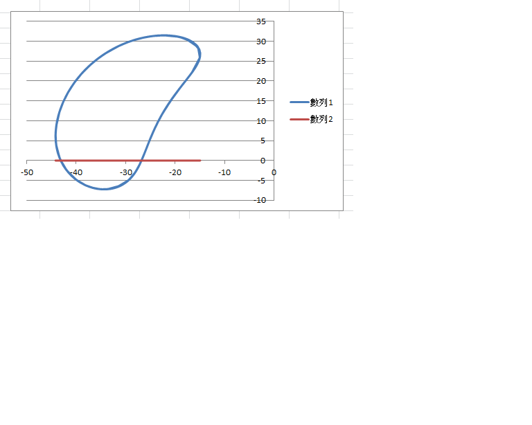
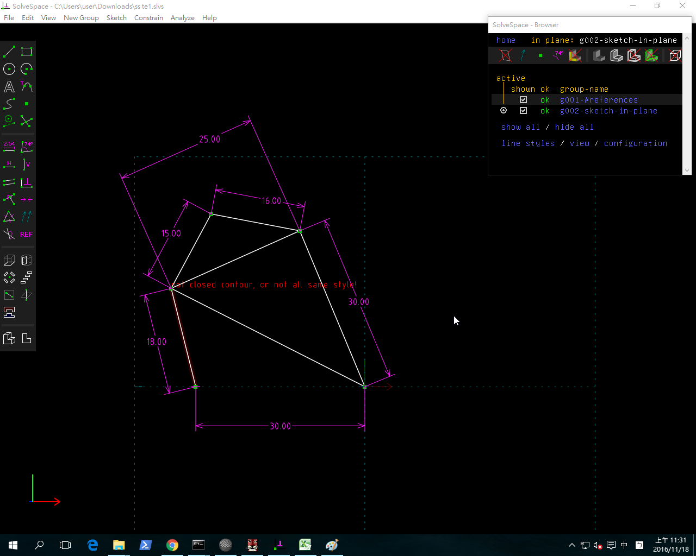
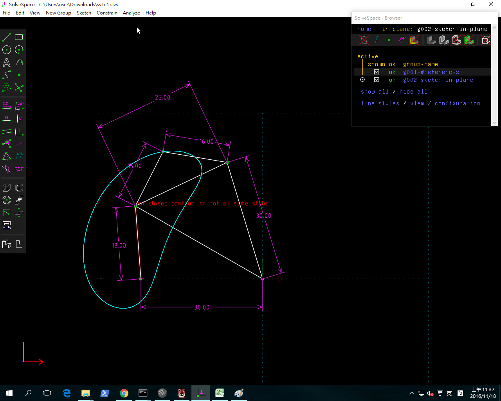

Title: 2016Fall Week10
Date: 2016-09-2 12:00
Category: Misc
Tags: 使用導引, 創造力, 表達能力, 協同設計
Author: 40423248

fgh Week10

操作四連桿機構的模擬狀況,並截圖還有錄製影片

<iframe src="https://player.vimeo.com/video/199116276" width="640" height="512" frameborder="0" webkitallowfullscreen mozallowfullscreen allowfullscreen></iframe>

<a href="https://vimeo.com/199116276">Solvespace 四連桿機構模擬測試</a> from <a href="https://vimeo.com/user46447136">40423248</a> on <a href="https://vimeo.com">Vimeo</a>.

