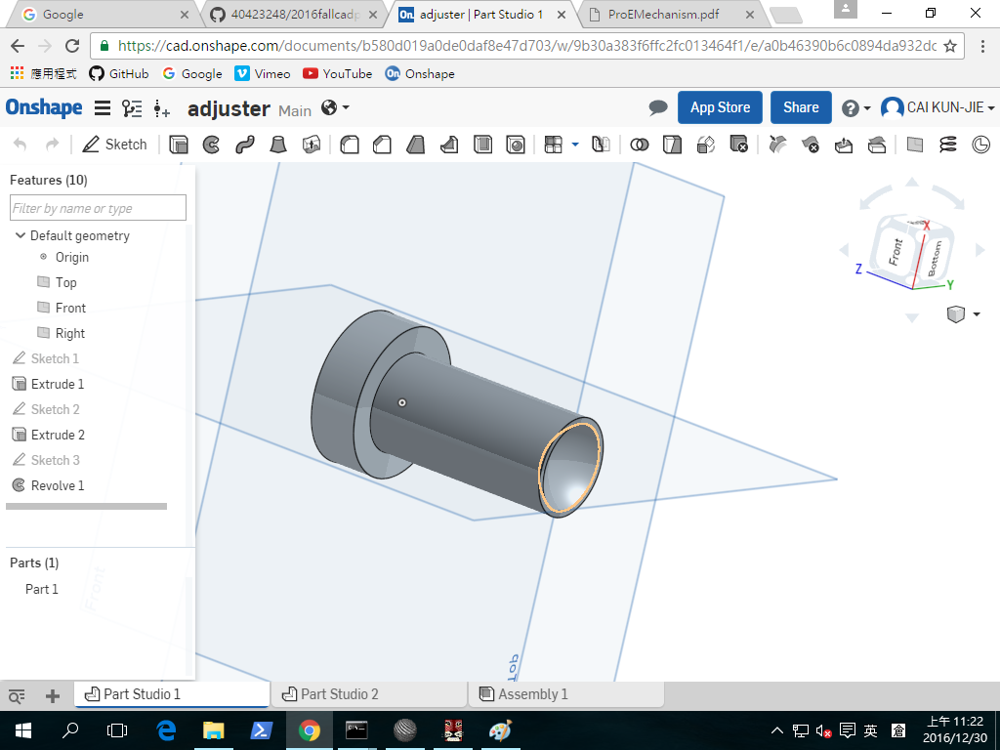
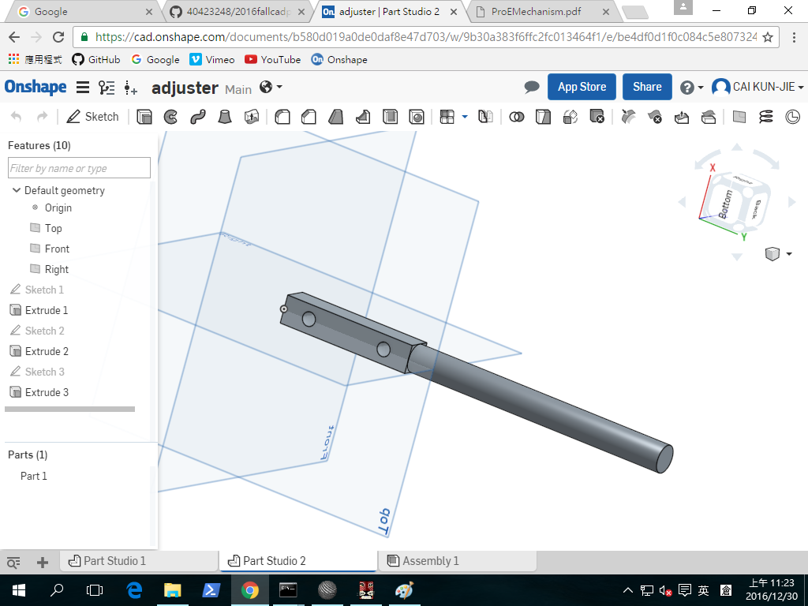
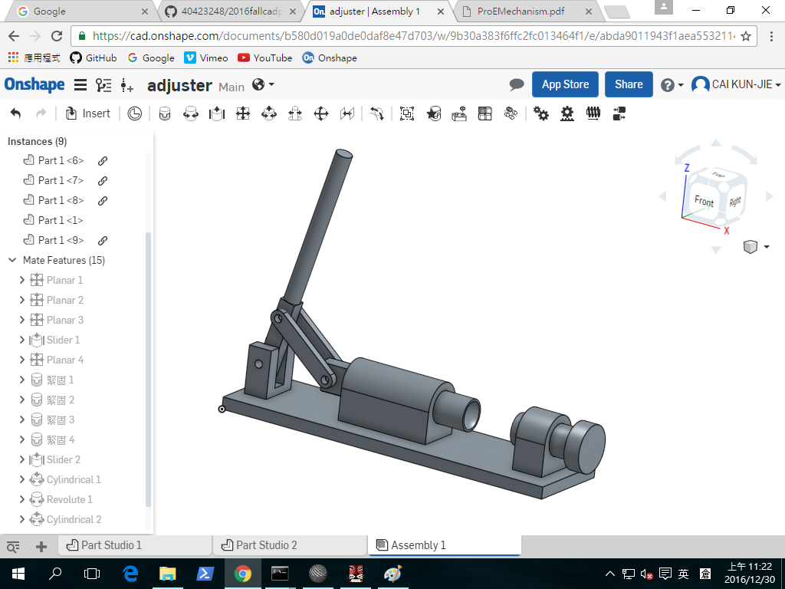

Title: 2016Fall 2016/12/30 Week16
Date: 2016-09-2 12:00
Category: Misc
Tags: 使用導引, 創造力, 表達能力, 協同設計
Author: 40423248

bnm

用OnShape畫出課程指定的連桿機構零件,在限制各部位的條件

<a href="https://cad.onshape.com/documents/b580d019a0de0daf8e47d703/w/9b30a383f6ffc2fc013464f1/e/a0b46390b6c0894da932dcea>P1</a>

<a href="https://cad.onshape.com/documents/b580d019a0de0daf8e47d703/w/9b30a383f6ffc2fc013464f1/e/be4df0d1f0c084c5e807324a>P2</a>

<a href="https://cad.onshape.com/documents/b580d019a0de0daf8e47d703/w/9b30a383f6ffc2fc013464f1/e/abda9011943f1aea55321149>AS1</a>

<iframe src="https://player.vimeo.com/video/199125162" width="640" height="344" frameborder="0" webkitallowfullscreen mozallowfullscreen allowfullscreen></iframe>

<a href="https://vimeo.com/199125162">OnShape小組繪圖測試</a> from <a href="https://vimeo.com/user46447136">40423248</a> on <a href="https://vimeo.com">Vimeo</a>.
